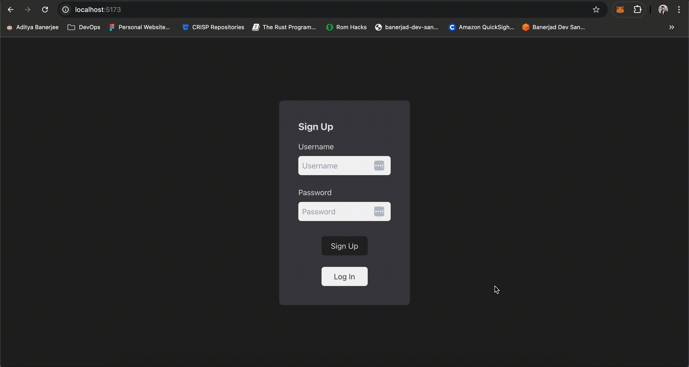
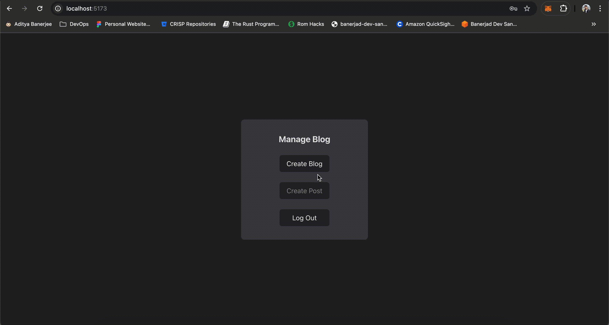

# Blogeo

## Introduction

This is a simple proof-of-concept automated blog builder.
The backend is built with [Bun](https://bun.sh) and [Drizzle ORM](https://drizzle.org/).
The frontend is built with [Bun](https://bun.sh), [React](https://reactjs.org/), [TypeScript](https://www.typescriptlang.org/), and [Vite](https://vitejs.dev/).

## Getting Started - Backend

### Prerequisites

- [Bun](https://bun.sh)
- [PostgreSQL](https://www.postgresql.org/)

### Installation

1. Clone the repository

```bash
git clone https://github.com/adidoesnt/blogeo.git
```

2. Install dependencies

```bash
cd blogeo/backend
bun install
```

3. Create a `.env` file in the root directory and add the following variables:

```bash
PORT=3000
DB_USER=postgres
DB_HOST=localhost
DB_DATABASE=blogeo
DB_PASSWORD=
DB_PORT=5432
JWT_SECRET=
JWT_EXPIRY=60
AWS_REGION=ap-southeast-1
SQS_ENDPOINT=http://localhost:4566/000000000000/local-queue
SQS_INTERVAL=30
SERVER_URL=http://localhost:3000
S3_ENDPOINT=http://localhost:4566
```

4. Create the database schema/migrations

```bash
bun run generate
```

5. Create a local SQS queue

```bash
bun run queue -- local-queue
```

6. Run the server (The migrations will be run automatically)

```bash
bun run start
# or 
bun run dev
```

## Getting Started - Frontend

### Prerequisites

- [Bun](https://bun.sh)
- [Vite](https://vitejs.dev/)

### Installation

1. Clone the repository (If you haven't already)

```bash
git clone https://github.com/adidoesnt/blogeo.git
```

2. Install dependencies

```bash
cd frontend
bun install
```

3. Create a `.env` file in the root directory and add the following variables:

```bash
VITE_SERVER_URL=http://localhost:3000
VITE_BLOG_STATUS_INTERVAL=10
```

4. Start the development server

```bash
bun run dev
```

5. Open the application in your browser

```bash
open http://localhost:5173
```

## Walkthrough
1. Sign up for a new account (or login if you already have one)


2. Create a new blog


3. Wait for the blog to be deployed, and make some posts


4. View the posts in the blog


## License

[MIT](https://choosealicense.com/licenses/mit/)
